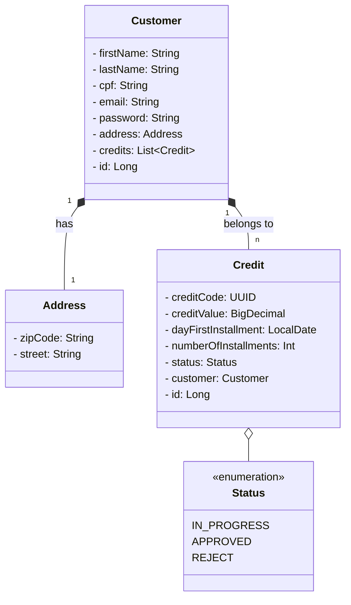

# Credit Application System

## 📝 Class Diagram

```mermaid
classDiagram
  class Customer {
    - firstName: String
    - lastName: String
    - cpf: String
    - email: String
    - password: String
    - address: Address
    - credits: List~Credit~
    - id: Long
  }

  class Address {
    - zipCode: String
    - street: String
  }

  class Credit {
    - creditCode: UUID
    - creditValue: BigDecimal
    - dayFirstInstallment: LocalDate
    - numberOfInstallments: Int
    - status: Status
    - customer: Customer
    - id: Long
  }

  class Status {
      <<enumeration>>
    IN_PROGRESS
    APPROVED
    REJECT
  }

  Customer "1"*--"1" Address: has
  Customer "1"*--"n" Credit: belongs to
  Credit o-- Status
```

## 🛠️ Tools used

## 🚀 How to execute the project

## 👨🏻‍💻 Author 
Matheus Fernando Vieira Pinto.

https://www.linkedin.com/in/matheus-fvp/
